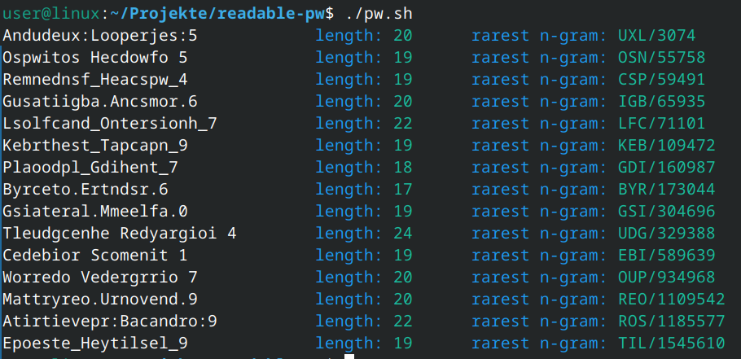

# Readable Passwords

Shell script that generates random passwords that might be pronouncable.



It uses language trigrams from [practicalcryptography.com](http://practicalcryptography.com/cryptanalysis/letter-frequencies-various-languages/) to generate words.

Length, amount of words, seperators, etc. are configurable within the script.

## Usage

```bash
git clone https://github.com/uriesk/readable-pw
cd readable-pw
./pw.sh
```
